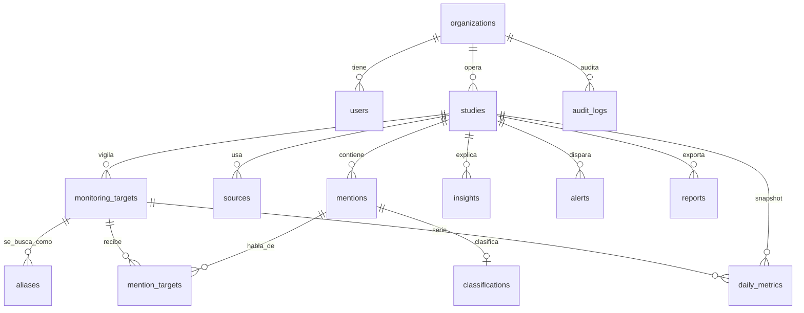

# Modelo de datos

Multi-tenant liviano: `organization_id` en las tablas de negocio. Identificadores UUID. Fechas en UTC.

## Entidades

- **organizations**: inquilino. En local, «Casa matriz».
- **users**: `username`, `email`, `password_hash`, `role`, `is_active`.
- **studies**: ventana, `scoring_config` (JSON), `is_demo`, `slug`.
- **monitoring_targets**: `kind` (`politician`, `government`, `state`, `party`, `topic`, `institution`) y `comparable`.
- **aliases**: nombre, apodo, hashtag o cuenta.
- **sources**: tipo de fuente y estado (`active`, `not_configured`, `disabled`).
- **mentions**: texto original, texto limpio, idioma, publicación, URL, autor público, engagement, geo, tema, hash normalizado, `license_note`, `is_synthetic`.
- **mention_targets**: relevancia 0–1 de esa mención para ese objetivo. Un chiste sobre un homónimo puede quedar debajo del umbral.
- **classifications**: sentimiento (`positive`, `negative`, `neutral`), postura (`in_favor`, `against`, `mixed`, `not_applicable`), emoción, toxicidad, ironía, confianza, `needs_review`.
- **daily_metrics**: snapshot por objetivo, día y fuente. El tablero recalcula en vivo para no depender de un job atrasado; la tabla guarda la serie materializada.
- **insights**: hallazgo en texto, generado a partir de números ya calculados.
- **alerts**: regla `negativity_spike_24h` cuando la negatividad sube 15 puntos en 24 h y ambas ventanas tienen volumen.
- **reports**: reservada para PDF y XLSX.
- **audit_logs**: login y cargas. Sin contraseñas en `detail`.

## Semilla

Un estudio, «Sentimiento Gobierno de Coahuila — 30 días», con:

- Elena Varela, Mateo Ríos y Lucía Herrera (perfiles ficticios, `comparable`)
- Gobierno de Coahuila
- Agua en Coahuila (tema)

2,000 menciones sintéticas en español de México, sesgadas por fuente. No son personas reales.
